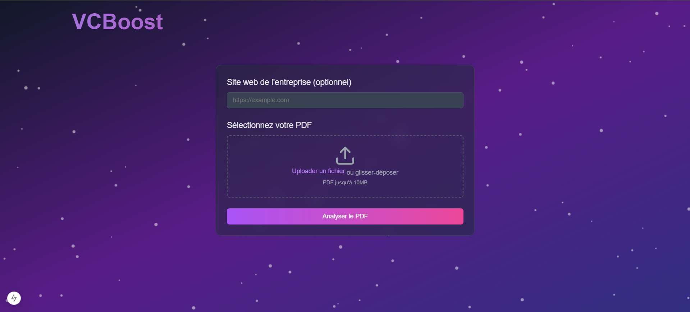

# VCBoost



## Table of Contents
- [About the Project](#about-the-project)
- [Built With](#built-with)
- [Getting Started](#getting-started)
  - [Direct Usage](#direct-usage)
  - [Local Setup](#local-setup)

## About the Project

Our AI-powered tool revolutionizes startup analysis by examining pitch decks and websites while enriching this data with insights from four robust sources: PredictLeads, SimilarWeb, Harmonic, and PeopleDataLabs. The result? A clear, actionable analysis that delivers a comprehensive 360-degree view of each startup.

### Key Features

- **One-Pager Generation**: Automatically creates a concise summary of a startup's strengths, weaknesses, and key metrics
- **Startup Scoring**: Provides a quantitative score based on multiple factors, offering a quick assessment of a startup's potential
- **Interactive Analysis**: Analysts can ask specific questions and receive tailored insights directly from the data

### Innovative Capabilities

- **CRM Integration**: Detect if you've previously analyzed the same startup and compare startups directly within the tool
- **Data Transparency**: Every data point is clickable, allowing users to trace insights back to their original sources for full transparency
- **Advanced Comparisons**: Identify key metrics and patterns across startups to uncover future category leaders
- **Portfolio Backtesting**: Analyze historical data to identify success patterns and enhance decision-making

### Future Developments

- **Email Integration**: Automatically analyze startup decks received via email and store results on your device
- **Privacy-Focused Design**: Utilize a local language model (LLM) for secure, offline interactions
- **Enhanced Reliability**: Cross-check data across multiple sources for superior accuracy and reliability

### Why It Matters

This tool empowers venture capital analysts to save time and make better decisions by streamlining startup evaluation. Its fast, accurate, and interactive approach ensures analysts can focus on identifying the most promising opportunities.

## Built With

- Node.js

## Getting Started

### Direct Usage

Visit our website to use the product directly: [Website Link]

### Local Setup

Follow these steps to set up the project locally:

#### Prerequisites

1. Install nvm:
   ```bash
   curl -o- https://raw.githubusercontent.com/nvm-sh/nvm/v0.40.1/install.sh | bash
   ```

2. Install Node.js:
   ```bash
   nvm install 22
   ```

3. Verify installations:
   ```bash
   node -v  # Should print "v22.13.0"
   nvm current  # Should print "v22.13.0"
   npm -v  # Should print "10.9.2"
   ```

#### Installation

1. Clone the repository:
   ```bash
   git clone https://github.com/Lironeee/Deckalyst.git
   ```

2. Install dependencies:
   ```bash
   npm install next@latest react@latest react-dom@latest
   ```

3. Configure environment variables:
   Create a `.env` file with the following keys:
   ```env
   PDL_API_KEY=    # to access people data labs data
   HARMONIC_API_KEY=    # to access harmonic ai data
   OPENAI_API_KEY=    # to access open ai models
   ```

4. Start the development server:
   ```bash
   npm run dev
   ```

5. Connect to localhost in your browser
